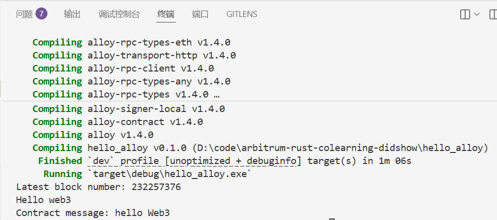
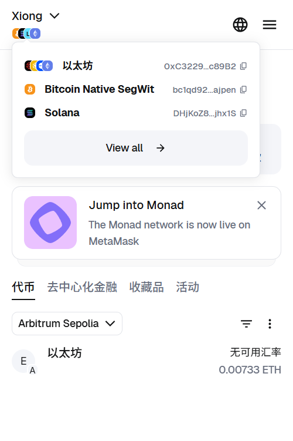
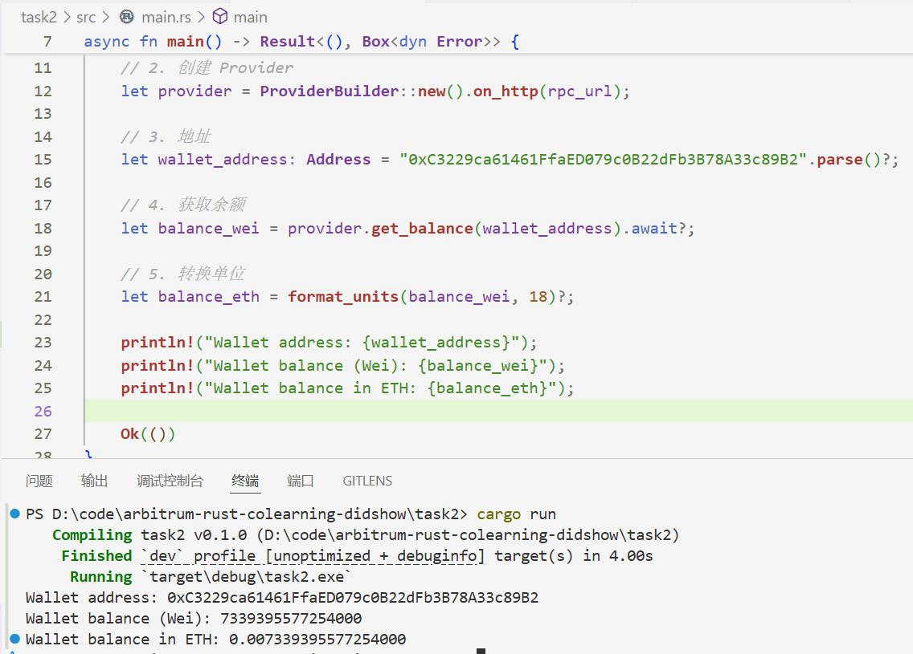
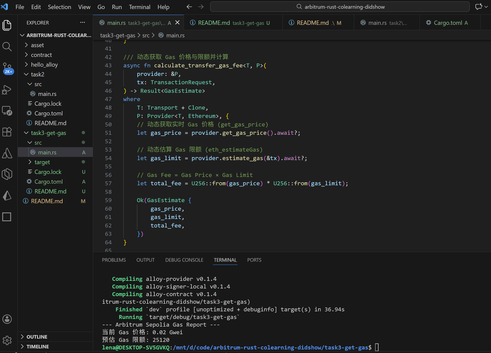

# arbitrum-rust-colearning-didshow

## How to run

`cargo build`
`cargo run`

## task1: hello web3

### 1、连接 metamask、切换 Arbitrum 配置、领取测试币


### 2、下载 Rust


### 3、创建新项目、完成编译




## task2: get balance of my address

### my address and balance



### get balance and convert wei to eth



## task3: get gas fee immidiately

### formular

`gas fee = gas price * gas limit`

### run result



## task4: transfer script

### How to run

`.env`

```
RPC_URL=
PRIVATE_KEY=
TO_ADDRESS=
```

### Run Result


### Transaction Browser Screenshot


## task 5: interact wirh contact(sol)

### get abi
